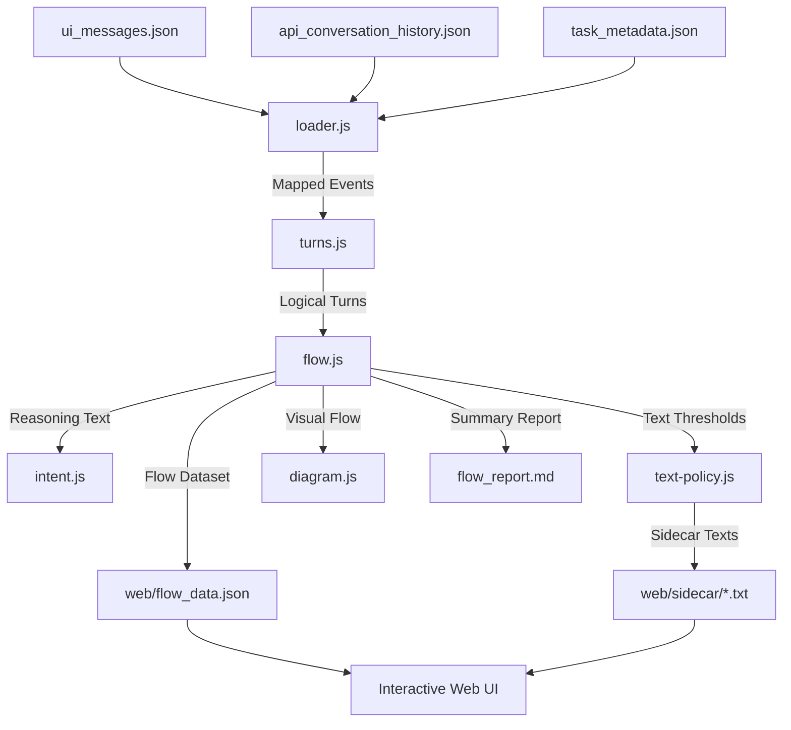

# Cline Agent Loop Analyzer & Simulator

An interactive, premium visual analysis and simulation system designed to parse, debug, play back, and explain Cline Agent execution logs (`ui_messages.json`). 

This project processes raw trace streams, extracts key performance metrics, performs intent-based analysis, and serves a modern, glassmorphic dashboard to simulate the agent's decision-making loop step-by-step.

---

## Table of Contents
1. [Architecture & Implementation Details](#architecture--implementation-details)
2. [Component Breakdown](#component-breakdown)
3. [Dashboard Features](#dashboard-features)
4. [Getting Started & Setup Guide](#getting-started--setup-guide)
5. [How to Analyze a New Log](#how-to-analyze-a-new-log)
6. [Testing Workflow](#testing-workflow)
7. [Git Exclusions & Confidentiality](#git-exclusions--confidentiality)

---

## Architecture & Implementation Details

The system operates in a pipeline, transforming a chronological stream of user interface events and LLM logs into structured, interactive step turns:



### The Event Lifecycle
1. **Intake**: Raw events are loaded and enriched. Subtypes (e.g. `tool`, `api_req_started`) are automatically parsed from stringified JSON when applicable.
2. **Turn Grouping**: Vòng lặp (loops) are divided by `api_req_started` boundaries. Any event occurring between one API request and the next belongs to that turn.
3. **Intent Recognition**: For each action (terminal command or tool call), the engine extracts the specific "why" from the LLM's reasoning text by performing keyword correlation analysis.
4. **Text Policy & Serialization**: The engine monitors the character length of request prompts, thoughts, actions, and outputs. If a block exceeds the token limit (200 tokens ~ 800 characters), it is truncated and written to a sidecar file.
5. **Flow Integration**: All stats, turns, and sidecars are consolidated into a single unified JSON schema.

---

## Component Breakdown

### Core Modules (`src/`)

- **`loader.js`**
  - **`load(taskDir)`**: Loads UI message logs, metadata, and LLM chat history. Maps UI events to corresponding API responses using `conversationHistoryIndex`. Sanitizes fields and formats raw properties.
- **`turns.js`**
  - **`groupTurns(events)`**: Groups events into logical turns. Each turn records `tsStart`, `tsEnd`, `request`, `reasoning`, `actions`, `taskProgress` checklists, and git `checkpoint` hashes.
  - **`parseChecklist(text)`**: Utilizes regular expressions (`/^- \[( |x|X)\]\s+(.*)$/`) to parse markdown checklists in the agent's task updates.
- **`text-policy.js`**
  - **`makeTextPolicy({ thresholdTokens, perKind, sink })`**: Returns a closure policy mapper. If the word/character count exceeds the threshold, it triggers the `sink` function to write the full text to a sidecar file and returns a truncated preview.
- **`intent.js`**
  - **`extractIntent(reasoning, action)`**: Analyzes the agent's thoughts to extract the *intent* of the proposed action. Scores sentences based on keyword proximity (matching tool names, paths, command arguments) and returns the most relevant reasoning sentence.
- **`diagram.js`**
  - **`toMermaid(turns)`**: Compiles the list of execution turns into a Mermaid DSL flowchart (`flowchart TD`) for visual rendering.
- **`flow.js`**
  - **`buildFlow(run, { thresholdTokens, perKind, sink })`**: Coordinates the entire pipeline. Aggregates totals (durations, costs, cache hits, token usage) and packages the turns list.
- **`render-md.js`**
  - **`renderMarkdown(flow)`**: Converts the structured flow object into a readable markdown report with Mermaid blocks, summary tables, and sidecar file paths.

### CLI Entrypoints
- **`parser.js`**: Integrates the `src/` modules. Accepts command-line parameters to target specific log folders, builds the flow, and saves output to the root and `/web` directories.
- **`parser.ps1`**: A native PowerShell equivalent for environments without Node.js in the shell's PATH.

---

## Dashboard Features

The Web App located in `/web` is a modern, responsive Single Page Application (SPA) styled with custom dark-mode CSS and glassmorphic designs:

- **Performance Overview Cards**: Monitors cumulative metrics (Cost, Token In/Out, Cache hit rate, duration, steps) dynamically loaded from the parsed dataset.
- **Playback Simulator Panel**: A dedicated player interface with:
  - **Controls**: Play/Pause, Step Forward, Step Backward, Restart.
  - **Speed Selector**: Fast (2s), Normal (4s), and Slow (8s).
  - **Progress Slider**: Shows active turn indexes and allows scrubbing.
- **Event Timeline**: A vertical timeline panel representing steps with specialized icons and hover animations. Clicking any turn jumps the simulator to that step.
- **Dynamic Tabs**:
  - **Simulator Tab**: Shows reasoning thought bubbles, action configurations, output logs, current task checklists, and git checkpoints.
  - **Performance Tab**: Renders Chart.js line charts tracking Token accumulation, Cost accumulation, and a doughnut chart showing Cache Hit distribution.
  - **Flowchart Tab**: Renders a graph layout of execution nodes powered by Mermaid.js.
  - **Inspector Tab**: Shows the raw JSON tree of the selected step for details.
- **Sidecar Modal Dialog**: When viewing truncated steps, clicking the **View full** link fetches and renders the complete sidecar text file asynchronously inside a dark-blur modal without reloading.

---

## Getting Started & Setup Guide

### 1. Prerequisites
- **Node.js**: Version 18.0.0 or higher.
- **Terminal**: Bash, Zsh, or PowerShell.

### 2. Install Project Dependencies
Run the install command to fetch development dev dependencies (like testing packages):
```bash
npm install
```

### 3. Parse and Serve Commands
* **To parse the default test log case (`cline-log/1782757522666`):**
  ```bash
  npm run parse
  ```
* **To run the web application server:**
  ```bash
  node serve.mjs
  ```
  Open your web browser and navigate to:
  **`http://localhost:8099/`**

---

## How to Analyze a New Log

To analyze any execution trace from Cline:

1. **Locate the log folder** generated by the Cline extension. It usually contains `ui_messages.json`, `api_conversation_history.json`, and `task_metadata.json`.
2. **Move the folder** to the `cline-log/` directory, naming it after the Task ID (e.g. `cline-log/my-custom-task`).
3. **Execute the parser** specifying your folder name as an argument:
   ```bash
   node parser.js my-custom-task
   ```
4. **Start the local server** (if not already running) using `node serve.mjs`.
5. **Open the browser** at `http://localhost:8099/` to interactively debug your new execution loop!

---

## Testing Workflow

This project includes unit tests checking all core parsing modules. The test runner uses Node's native test library.

To run the unit tests:
```bash
npm test
```

Expected output:
```text
▶ cline-analyzer-agent
  ▶ diagram.js
    ✔ should generate valid mermaid flowchart (0.5ms)
  ...
  ▶ turns.js
    ✔ should group events into logical turns (0.3ms)
✔ cline-analyzer-agent (13.6ms)

ℹ tests 10
ℹ suites 8
ℹ pass 10
ℹ fail 0
```

---

## Git Exclusions & Confidentiality

As log files and outputs may contain sensitive information or proprietary case contents, the **`.gitignore`** is strictly configured to prevent pushing these directories to public remotes:
```text
node_modules/
out/
cline-log/
flow_data.json
flow_report.md
web/flow_data.json
web/sidecar/
```
Only source code files (`src/`, `web/`, `test/`), build scripts, and configurations are tracked in Git.
