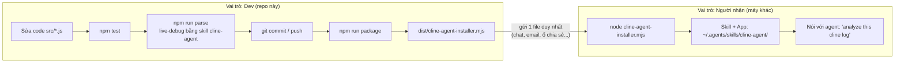

# Guideline vận hành — Cline Agent Loop Analyzer

Tài liệu này mô tả toàn bộ quy trình làm việc trên dự án này, theo **từng vai
trò**: người phát triển (dev, làm việc trực tiếp trong repo này) và người
nhận (nhận app qua installer, không có source code). Mỗi bước đều có phần
**Quickstart** (lệnh chạy ngay) và phần giải thích chi tiết bên dưới.

Xem thêm: [README.md](../README.md) (kiến trúc, module),
[docs/packaging.md](packaging.md) (chi tiết cờ installer),
[docs/analysis-schema.md](analysis-schema.md) (schema `analysis.json`).

---

## 0. Sơ đồ vai trò



Hai vai trò không dùng chung công cụ:

| | Dev | Người nhận |
|---|---|---|
| Có source code? | Có (toàn bộ repo) | Không (chỉ bundle đã minify) |
| Sửa được logic parser? | Có | Không |
| Cách chạy | `npm run parse`, `node serve.mjs`, skill `cline-agent` | Chỉ nói chuyện với agent, skill `cline-agent` tự lo |
| Build/package | Có (`npm run package`, skill `cline-agent-dev`) | Không cần |
| Nhận update | Sửa code trực tiếp | Chạy lại installer mới |

---

## 1. Dev — Sửa code

### Quickstart
```bash
npm install                 # 1 lần, cài devDependencies (esbuild, mermaid)
# ...sửa file trong src/, web/, test/...
npm test                    # chạy toàn bộ unit test
npm run parse                # parse log mẫu cline-log/1782757522666
node serve.mjs               # mở http://localhost:8099 xem kết quả
```

### Chi tiết
- Toàn bộ logic nằm ở `src/*.js` (xem bảng module trong [README.md](../README.md#component-breakdown)):
  `loader.js` → `turns.js` → `intent.js`/`flow.js` → `expectation.js`/`conformance.js`
  → `fta.js` → `report.js`.
- **Không sửa trực tiếp** `dist/` — thư mục này chỉ là kết quả build, bị ghi
  đè mỗi lần `npm run package`.
- Sau khi sửa `src/`, cách nhanh nhất để thấy thay đổi chạy thật là dùng
  skill **`cline-agent`** (menu Clean / Live-debug) thay vì gõ tay từng lệnh
  `node parser.js ... --watch` + `node serve.mjs` — skill tự lo cả ba bước
  serve → watch → open và tránh chạy trùng server/watcher.
- Chạy `npm test` trước khi commit — bộ test dùng `node --test` (native),
  không cần framework ngoài.

---

## 2. Dev — Test trên log thật

### Quickstart
```bash
# copy folder log Cline vào cline-log/<tên-task>/ trước
node parser.js cline-log/<tên-task> --watch
node serve.mjs
```

### Chi tiết
- Một folder log hợp lệ chứa `ui_messages.json` (bắt buộc), và thường có
  thêm `api_conversation_history.json`, `task_metadata.json`.
- `--watch` parse ngay lần đầu rồi tự parse lại mỗi khi 3 file trên thay
  đổi (debounce, an toàn khi Cline đang chạy task live).
- Log thô và output sinh ra (`out/`, `flow_data.json`, `web/sidecar/`, …) có
  thể chứa nội dung nhạy cảm — **đã bị `.gitignore`**, không commit.
- Dọn output sinh ra: `npm run clean` (không đụng vào source hay
  `cline-log/`).

---

## 3. Dev — Share code (git)

### Quickstart
```bash
git add src/ web/ test/ docs/ package.json README.md
git commit -m "..."
git push
```

### Chi tiết — chỉ những thứ này được track trong git
| Track (commit) | Không track (đã gitignore) |
|---|---|
| `src/`, `web/`, `test/`, `docs/`, `parser.js`, `serve.mjs`, `clean.js`, `package.json` | `node_modules/`, `out/`, `cline-log/`, `flow_data.json`, `flow_report.md`, `web/flow_data.json`, `web/sidecar/`, `dist/` |

`dist/` không track vì đó là **build artifact** — người nhận không cần và
không nên clone repo git, họ chỉ cần 1 file installer (mục 5).

---

## 4. Dev — Build (package) app để phân phối

### Quickstart
```bash
npm install          # nếu chưa có esbuild
npm run package
```
Hoặc gọi skill **`cline-agent-dev`** (chỉ có trong repo dev này) — skill tự
kiểm tra dependency rồi chạy đúng lệnh trên.

### Chi tiết
- Script build: `scripts/build-installer.mjs` (esbuild, bundle + minify,
  target Node 18, ESM).
- Kết quả trong `dist/` (gitignore):

  | File | Nội dung |
  |---|---|
  | `dist/cline-agent-installer.mjs` | **File duy nhất cần gửi.** Self-extracting, nhúng base64 toàn bộ app + skill. |
  | `dist/app/` | Bản app đã bundle để kiểm tra thủ công (`parser.js`, `clean.js`, `serve.mjs`, `web/`, `docs/`, `package.json`). |
  | `dist/skill/cline-agent/SKILL.md` | Skill bản phân phối, build từ `.claude/skills/cline-agent/SKILL.md`. |

- Muốn đổi nội dung skill mà người nhận thấy → sửa [.claude/skills/cline-agent/SKILL.md](file:///e:/the.thoi/Project/cline-agent/cline-agent/.claude/skills/cline-agent/SKILL.md) (sau đó quá trình đóng gói sẽ tự động tối ưu hóa file này thành bản phân phối).
- Sau khi sửa `src/` xong, luôn build lại (`npm run package`) trước khi gửi
  installer mới — installer không tự đồng bộ với source đang thay đổi.

---

## 5. Dev — Share app/skill cho máy khác

### Quickstart
Gửi đúng **1 file** cho người nhận, qua kênh bất kỳ (chat, email, ổ chia sẻ):
```
dist/cline-agent-installer.mjs
```

### Chi tiết
- Không gửi source tree, không gửi cả repo git.
- Người nhận chỉ cần Node.js v18+ và file này.
- Nâng cấp: build lại → gửi lại đúng file này (đè tên cũ hoặc gửi bản mới),
  người nhận chạy lại installer là tự upgrade in-place (dựa vào
  `version.json` trong app đã cài).

---

## 6. Người nhận — Cài đặt lần đầu

### Quickstart
```bash
node cline-agent-installer.mjs
```

### Chi tiết — hoạt động của installer
Installer sẽ giải nén và cài đặt toàn bộ ứng dụng cùng các file script thực thi đi kèm vào thư mục skill của Agent:
- Thư mục mặc định: `~/.agents/skills/cline-agent/` (Windows: `%USERPROFILE%\.agents\skills\cline-agent`).

Ứng dụng chạy trực tiếp bên trong thư mục này (ở thư mục con `scripts/`), không có thư mục ứng dụng riêng biệt ngoài thư mục skill.

Sau khi cài, người nhận **không cần biết command nào cả** — chỉ cần nói với
agent của họ, ví dụ:
> "analyze this cline log" / "open the cline dashboard" / "live debug the agent loop"

Skill `cline-agent` sẽ tự hỏi Clean hay Live-debug, rồi tự chạy
parse → serve → mở trình duyệt tại `http://localhost:8099/`.

### Cờ tuỳ chọn khi cài
| Cờ | Ý nghĩa |
|---|---|
| `--project <dir>` | Cài skill theo project (`<dir>/.agents/skills/cline-agent`) thay vì global. |
| `--force` | Cho phép ghi đè thư mục skill cũ không do installer tạo (mặc định từ chối để an toàn). |

---

## 7. Người nhận — Nâng cấp

### Quickstart
```bash
node cline-agent-installer.mjs
```
(chạy lại đúng file installer mới nhận được — không có lệnh nào khác)

### Chi tiết
- Installer đọc `version.json` của bản đã cài để nhận diện, rồi thay thế
  sạch (an toàn: từ chối ghi đè nếu thư mục không phải do installer tạo,
  trừ khi có `--force`).
- Log đã parse không bị đụng tới khi upgrade.

---

## 8. Checklist nhanh (dán vào chat khi cần nhắc việc)

**Dev — mỗi lần sửa code:**
- [ ] `npm test` pass
- [ ] Test bằng log thật qua skill `cline-agent` (live-debug)
- [ ] `git commit` + `git push` (chỉ source, không output/log)
- [ ] Nếu cần phân phối: `npm run package` → gửi `dist/cline-agent-installer.mjs`

**Người nhận — mỗi lần nhận file mới:**
- [ ] Có Node.js v18+
- [ ] `node cline-agent-installer.mjs`
- [ ] Nói với agent: "analyze this cline log" (không cần nhớ lệnh nào khác)
